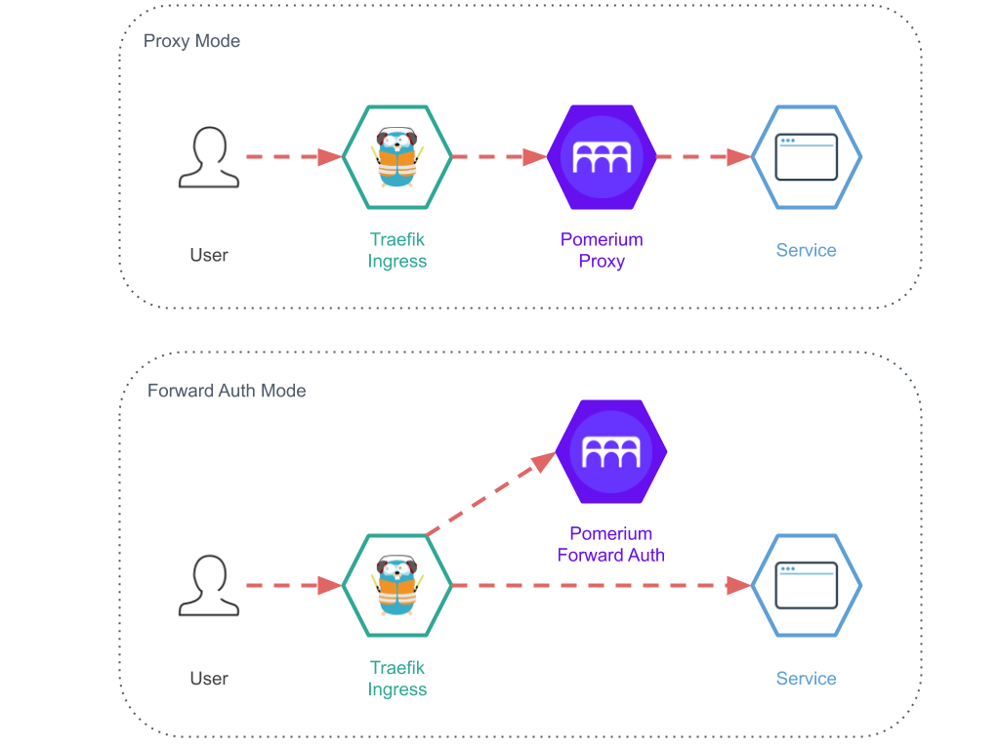
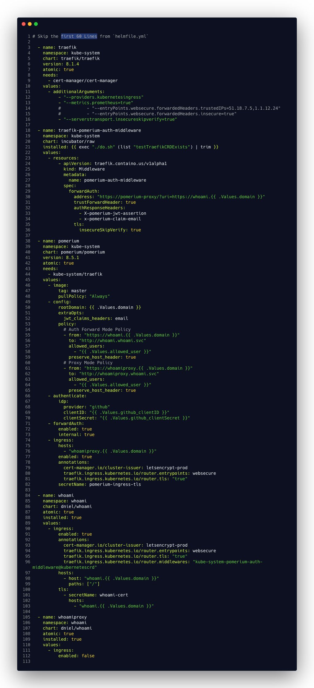

# Traefik with Pomerium Forward Auth and Proxy on Kubernetes with Helm

This fully functional end to end example demonstrates the usage use of Pomerium together with Traefik to make upstream 
Resources only accessible after authentication and authorization.  
This example has its primary focus on [Pomerium](https://www.pomerium.io/) which is an outstanding identity-aware access
Proxy which amongst [other things](https://docs.pomerium.io/docs/) support AuthN(tication) and AuthZ(orization).

Pomerium is not the firs auth proxy, but it is exceptional as it not only tries to protect self crafted operational dashboards or services but really intends to provide AuthN/AuthZ that could be bundled with demanding customer facing applications providing a rich set of options.

## BOM - Bill of Materials

We need to have a running Kubernetes Cluster which is accessible over the internet. We need public accessibility for ordering Let's Encrypt certificates.
IMHO the [easiest][Easy Testing with k3s] way is to spin up a K3s Single Node Cluster on [DO][DO], [SCW][SCW], [Hetzner][HZ] or at any other Hoster of your choice.
 
[DO]: https://www.digitalocean.com/
[SCW]: https://scaleway.com
[HZ]: https://www.hetzner.com/cloud

- Traefik   2.2.x       - Our Ingress Controller.
- Pomerium  0.7.5       - Identity-aware access proxy for AuthN and AuthZ.
- Helm      3.2         - The way we deploy to Kubernetes.
- Helmfile  v0.113.0    - The declarative way to deploying helm charts. This example also works without Helmfile you just need to cope and paste values. 
- k3d       latest      - (Optional) k3s in Container if you want to test is all locally.

### Helm Charts

- pomerium/pomerium-8.5.1
- containous/traefik-8.0.2
- jetstack/cert-manager-v0.14.1
- dniel/whoami-0.4 - A simple application that displays back all request it receives. Handy to view the set Headers.

## Background

The Pomerium documentation does not emphasize it enough, there are actually two distinct type of operation supported.

1. Proxy Mode
2. Forward Auth Mode

Both modes can be used at the same time and have their pros and cons.  The below diagram compares the both modes visually.



This example incorporates both modes in one deployment. The service `whoami` is protected with Forward Auth and `whoamiproxy` sits behind Pomerium Proxy.

## Deployment

Before you start verify that you have all the needed tools from the [BOM - Bill of Materials](#BOM---Bill-of-Materials) section installed and working.


Clone this repository or just download the `helmfile.yaml` and `do.sh` to your project.
 
```sh
git clone git@github.com:8gears/Traefik-with-Pomerium-Forward-Auth-and-Proxy-on-Kubernetes-with-Helm.git
```

###  Mandatory Values

There are only a few values that are required before the Helmfile can be applied.

```yaml
environments:
  default:
    values:
      - domain: "corp.c8n.me" # Wildcard *.corp.c8n.me in our DNS
      - allowed_user: "githubloginemail@c8n.me"
      - github_clientID: "a3f5b7c93dd6afaxxxxx"
      - github_clientSecret: "442f2a4907e84e23388cd58060d0exxxxxxx"
      - acme_email: "pomerium@getnada.com"
```

- `domain`: the root domain to access our services and for Let's Encrypt to issue certificates. Create a wildcard domain in your DNS e.g. `*.corp.c8n.me` pointing to your Kubernetes Cluster. 
- `allowed_user`: The email of the user who is allowed to access our protected services. In our case it is going to be you. Add the email address that you normally use to log in to GitHub.
-  `github_clientID`/`github_clientSecret`: Follow the [Pomerium Docs guide][PG] on how to obtain the ID and Secret.

[PG]: https://master.docs.pomerium.io/docs/identity-providers/github.html

### Execute Helm/Helmfile Deployment

After we have customized the values and pointed the DNS `*.corp.c8n.me` to our K8s Cluster IP `1.2.3.4` we can start the actual deployment.

Run in the same directory where your customized `helmfile.yaml` is located:

```sh 
helmfile apply
```

After a few minutes everything should be set up and ready to test. 

Try it out the services by visiting:

- `https://whoami.corp.c8n.me/` 
- `https://whoamiproxy.corp.c8n.me/`

Replace (`corp.c8n.me`) with your domain.

Make sure you use `https` as `http` is diabled and there is no `http`->`https` redirection in place, otherwise you'll see a `404`.

### Attention Windows User 

Please use WSL. It's not a big deal if you can't execute `do.sh` shell on Windows. The workaround is to set the `installed: {{ exec..` to `false` and after installation rerun it a second time with `true`. Background is that the customer resources can only be installed after the CRDs. 
The `do.sh`  checks against the Kube API if the CRDs already exist.

## Findings and Conclusions

After our running setup, it is about time to understand how it actually all work.  
Let's analyze the Helmfile in detail by looking at every option that is relevant  to the Pomerium/Traefik collaboration.

### Traefik

- `"--providers.kubernetesingress"` - Allows us to use Kubernetes `kind: Ingress` type object and not only the Traefik CRD Specific kind: IngressRoute`.
- `"--serverstransport.insecureskipverify=true"` - Pomerium specific modification for Traefik to skip certificate verification on services behind the Ingress. This is setting is a workaround for Pomeriums Helm issue `insecure=true` and Traefiks [guessing][td] if a service has TLS enabled. Once [issue #88][iss88] is fixed this setting on Traefik can be 
removed and Pomerim config can be set to `generateTLS=fale` and `insecure=true` disabling TLS on the backend service to service communication.   
 
[iss88]: https://github.com/pomerium/pomerium-helm/issues/88
[pgentls]: https://github.com/pomerium/pomerium-helm/blob/master/charts/pomerium/values.yaml#L18
[td]: https://docs.traefik.io/routing/providers/kubernetes-ingress/#communication-between-traefik-and-pods      

#### Traefik Middleware for Pomerium Forward Auth Mode
 
Here we create a new Traefik custom resource `traefik-pomerium-auth-middleware` of `kind: Middleware`. 
This [Forward Auth Middleware][fam] specification is specific for Pomerium Forward Auth mode. This Middleware will be attached to the Ingress  
and call on each request `pomerium-proxy` to check if `pomerium-proxy` responses with HTTP 200 (access granted) or return whatever `pomerium-proxy` returns in case it isn't 200. Typical use cases are redirecting the user to the login page or display the user a access denied dialog.

- `forwardAuth.address` - The `uri` part should match the `policy.from` in policy block of Pomerium.
- `trustForwardHeader=true` -  See Traefik [trustForwardHeader][ttfh]
- `authResponseHeaders` - Traefik will copy those headers from the authentication server to the service request.  `x-pomerium-jwt-assertion` allows the service to use the jwt token. With`x-pomerium-claim-email` our 
backend service would get a header with the signed in user email and hence could use that to directly authorize the user. E.g. [Grafana proxy auth][gpa] demonstrates such a use case.   
- `insecureSkipVerify=true` Skip TLS verification on `https://pomerium-proxy` because of the self signed certs we should set that or add the Pomerium CA to Treaefik.
   
[gpa]: https://grafana.com/docs/grafana/latest/auth/auth-proxy/
[fam]: [https://docs.traefik.io/middlewares/forwardauth/](https://docs.traefik.io/middlewares/forwardauth/)
[ttfh]: https://docs.traefik.io/middlewares/forwardauth/#trustforwardheader 

### Pomerium 
  
- `rootDomain`: Based on the `rootDomain` Pomerium will create subdomains for its ingresses. In our case these would be `authenticate.corp.c8n.me` and `forwardAuth.corp.c8n.me` but only if `forwardAuth.internal` is set to `false`.
- `generateTLS=true`: Will generate certificates for secure inter pod communication between the Pomerium services 
`pomerium-proxy`: `pomerium-authenticate`, `pomerium-authorize`,`pomerium-cache` and other services interacting with Pomerium services.    
- `insecure=false`: If `true` HTTP will be used instead of HTTPS. See  [issue #88][iss88] 
- `extraOpts.jwt_claims_headers=email`: Instructs Pomerium Proxy to extract a header values from JWT. In this example we
 want the user email to be set in header `X-Pomerium-Claim-Email:`. This is setting is the counterpart defined in the treafik middleware. For example [Grafana proxy auth][gpa]  would rely on that header to sign-in/sign-up the user.

#### Pomerium Policy Block

The two policy blocks address two backend services `whoami` and `whoamiproxy`. As we can see the policies are agnostic to 
the two different mode of operation (Proxy and Forward Auth). It is not needed to explain every setting in the Policy block as it is already [well documented][pb].     

[pb]: https://www.pomerium.io/configuration/#policy

The Pomerium authenticate part addresses the configuration settings for the Identity Provider (IDP), which in our case is GitHub.

- `forwardAuth.enabled` Explicitly enable Forward Auth mode of operation, as Proxy mode is enabled by default. 
- `forwardAuth.internal=true` is crucial to Traefik, as it not only skips the creation of the Ingress for 
`forwardAuth`, but also configures (`forward_auth_url`)  in Pomerium to only listen on the internal service name (`pomerium.proxy`).
If we want to have forwardAuth accessible via Ingress, we also need to set `forwardedHeaders.trustedIPs` and 
`forwardedHeaders.insecure` in the Traefik configuration. 

The Pomerium Ingress part serves two purposes: it provides settings via annotation for the Pomerium Ingress itself (`authenticate.corp.c8n.me`). The Annotation part in this example addresses Traefik and  
cert-manager certificate issuer selection and certificate secret location.
The second purpose of the Ingress section in Pomerium is to define Ingress host names for the Pomerium Proxy mode. In the host section we define the domain name and select the ingress that is going to accept the inbound traffic.  
Requests to the protected services go over this ingress and are routed to go through the proxy. Based on the host name together with the `from` part in the policy block Pomerium deducts the target service (`to`) part.   

### Proxy and Forward Auth Example Releases

The releases `whoami` and `whoamiproxy` represent two protected services. For the service `whoami` Forward Auth is used and for `whoamiproxy`  Proxy mode. Both are based on the same chart, however the configurations are different. In the `whoami` release we need to configure an Ingress and importantly attach here the Traefik Middleware that was create in
 `traefik-pomerium-auth-middleware` . Somewhat unusual is the name pefix `kube-system` and postfix `@kubernetescrd`. The  [Traefik Provider Namespace](https://docs.traefik.io/middlewares/overview/#provider-namespace) documentation explains this in more detail.

The release `whoamiproxy` doesn't contain any Ingress as the Ingress is defined in Pomerium Ingress release See: (`ingress.hosts`)  
Any Ingress setting here would bypass Pomerium entirely and leave the service unprotected.




## Easy Testing with k3s/k3d

You can test locally with k3d. The `.do.sh test` command will create a local test cluster. To make it work with cert-manager make sure your local instance 
is reachable from the internet. Ngrok is your friend here.

If you have an ISP of your choice order a machine and install k3s its very simple:

Make sure you have ssh access to the machine and ports `22, 80, 443` and `6443` are reachable.
 
```sh
ssh root@1.2.3.4
curl -sfL https://get.k3s.io | sh -s - server --no-deploy traefik 
cat /etc/rancher/k3s/k3s.yaml
``` 

Copy the file `k3s.yaml` to your local computer and replace `server: https://127.0.0.1:6443` then try:

```sh
export KUBECONFIG=/copied/kube/config/from/server/location/k3s.yaml
kubectl --insecure-skip-tls-verify get nodes
```
## Reference to Alternative Solutions 

As stated in the beginning, Pomerium is the best but not the first.

 - [louketo-proxy aka Keycloak Gatekeeper](https://github.com/louketo/louketo-proxy) - Designed for Keycloak but now opened up for other IDPs.
 - [vouch-proxy](https://github.com/vouch/vouch-proxy) - An SSO solution for Nginx using the [auth_request](http://nginx.org/en/docs/http/ngx_http_auth_request_module.html) module.
[traefik-forward-auth](https://github.com/thomseddon/traefik-forward-auth) - Minimal forward authentication service that provides Google oauth based login and authentication for the traefik.
[oauth2-proxy/oauth2-proxy](https://github.com/oauth2-proxy/oauth2-proxy) - A reverse proxy and static file server that provides authentication using Providers (Google, GitHub, and others) to validate accounts by email, domain or group. Formly [bitly/OAuth2_Proxy](https://github.com/bitly/oauth2_proxy)
- [simov/grant](https://github.com/simov/grant) - Nodejs based OAuth Proxy for 180+ IDPs.
- [ory/oathkeeper](https://github.com/ory/oathkeeper) - ORY Oathkeeper is an Identity & Access Proxy (IAP) and Access Control Decision API that authorizes HTTP requests based on sets of Access Rules. The BeyondCorp Model is designed by [Google](https://cloud.google.com/beyondcorp/) and secures applications in Zero-Trust networks.

## Sponsor

This project is sponsored by [8gears](https://8gears.com) - We help SaaS business to ship faster to the Cloud with less pain.
