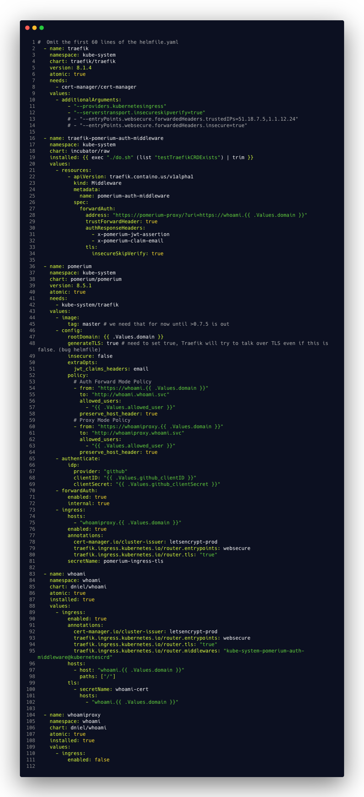

# Traefik with Pomerium Forward Auth and Proxy on Kubernets with Helm

This fully functional end to end example demonstrates the usage use of Pomerium together with Traefik to make upstream 
resources only accessible after authentication and authorization.  
This example has its primary focus on [Pomerium](https://www.pomerium.io/) which is an outstanding identity-aware access
proxy which amongst [other things](https://docs.pomerium.io/docs/) support AuthN(tication) and AuthZ(orization).

Pomerium is not the firs auth proxy, but it is exceptional in a way it doesn't only aim to protect some 
self crafted operational dashboards or services but really intends to provide AuthN/AuthZ that could be bundled with 
high demand customer facing application with a rich set of options.

## BOM - Bill of Materials

We need to have a running Kubernetes Cluster which is accessible over the internet. We need public accessibility for ordering Let's Encrypt certificates.
IMHO the [easiest][Easy Testing with k3s] way is to spin up a K3s Single Node Cluster on [DO][DO], [SCW][SCW], [Hetzner][HZ] or at any other hoster of your choice.
 
[DO]: https://www.digitalocean.com/
[SCW]: https://scaleway.com
[HZ]: https://www.hetzner.com/cloud

- Traefik   2.2.x       - Our Ingress Controller
- Pomerium  0.7.5       - Identity-aware access proxy for AuthN and AuthZ
- Helm      3.2         - The way we deploy to Kubernetes
- Helmfile  v0.113.0    - The declarative way to deploying helm charts
- k3d       latest      - (Optional) k3s in Container if you want to test is all locally.

### Helm Charts

- pomerium/pomerium-8.5.1
- containous/traefik-8.0.2
- jetstack/cert-manager-v0.14.1
- dniel/whoami-0.4 - A simple application that displays back all request it receives. Handy to view the set Headers.

## Background

The Pomerium documentation does not emphasize it enough, there are actually two distinct type of operation supported.

1. Proxy Mode
2. ForwardAuth Mode

Both modes can be used at the same time and have their pros and cons.  The below diagram compares the both modes visually.


This example supports both modes in one deployment. The service `whoami` is protected with Forward Auth and `whoamiproxy` 
via Proxy mode.

## Deployment

Before we start verify you have all the needed tools from the [BOM - Bill of Materials](#BOM---Bill-of-Materials) section installed.


One way is to clone this repository or just copy the two need file `helmfile.yaml` and `do.sh`
 
```sh
git clone 
```

### Setting Mandatory Values

There are only a few values that are mandatory before we can apply the Helmfile.

```yaml
environments:
  default:
    values:
      - domain: "corp.c8n.me" # Wildcard *.corp.c8n.me in our DNS
      - allowed_user: "githubloginemail@c8n.me"
      - github_clientID: "a3f5b7c93dd6afaxxxxx"
      - github_clientSecret: "442f2a4907e84e23388cd58060d0exxxxxxx"
      - acme_email: "pomerium@getnada.com"
```

- `domain`: A wildcard `*.corp...` domain for services access and for Let's Encrypt Certificates. 
- `allowed_user`: The email of the user who is allowed to access our protected services. 
In our case it is going to be you. Add the email address that you normally use to login to GitHub.
-  `github_clientID`/`github_clientSecret`: Follow the [Pomerium Docs guide][PG] on how to obtain the ID and Secret.

[PG]: https://master.docs.pomerium.io/docs/identity-providers/github.html

### Execute Deployment

After we have customized the values and pointed our DNS `*.corp.c8n.me` to our K8s Cluser IP `1.2.3.4` we can start the actual deployment.

Run in the same directory where your customized `helmfile.yaml` is located:

```sh 
helmfile apply
```

After a few minutes everything should be set up and ready to go. 

Try it out by visiting:

- `https://whoami.corp.c8n.me/`
- `https://whoamiproxy.corp.c8n.me/`

Make sure you use `https` as `http` is diabled and `http`->`https` redirection is not active otherwise you'll get a `404` 

### Windows User Attention

Please use WSL.
It's not a big deal if you can't execute `.do.sh`. The solution is to replace the `exec` part with `false` and for 
second round with `true`. Background is that the customer resources can't be installed before the CRDs. 
The `.do.sh` does check that against the Kube API to see if the CRDs already exist.

## Findings and Conclusions

After the working setup it is about time to understand how it actually work.  
Let's analyze the Helmfile in detail looking at every option and especially the relevant ones to the Pomerium/Traefik collaboration.

### Traefik

- `"--providers.kubernetesingress"` - Allows us to use Kubernetes `kind: Ingress` type Object and not only the 
Traefik CRD Specific kind: IngressRoute`.
- `"--serverstransport.insecureskipverify=true"` - Pomerium specific modification to skip verification of certificates 
presented by services behind the Ingress. This is setting is a workaround for Pomeriums Helm issue `insecure=true` 
and Traefiks [guessing][td] if a service has TLS or not. Once [issue #88] is fixed this setting on Traefik can be 
removed and Pomerim config can be set to `generateTLS=fale` and `insecure=true` disabling TLS on the backend.   
 
[iss88]: https://github.com/pomerium/pomerium-helm/issues/88
[pgentls]: https://github.com/pomerium/pomerium-helm/blob/master/charts/pomerium/values.yaml#L18
[td]: https://docs.traefik.io/routing/providers/kubernetes-ingress/#communication-between-traefik-and-pods      

#### Traefik Middleware for Pomerium Forward Auth Mode
 
Next is we create a new Traefik custom resource release `traefik-pomerium-auth-middleware` of `kind: Middleware`. 
This forward Auth Middleware is specific to Pomerium Forward Auth mode. This Middleware will be attached to an Ingress 
and on each request it will call `pomerium-proxy` and forward the request if `pomerium-proxy` responses with HTTP 200 
or return whatever `pomerium-proxy` returns in case it isn't 200. Specifically redirect the user to login or deny access.

- `forwardAuth.address` - The path part should match the `policy.from` with the corresponding policy block.
- `trustForwardHeader=true` - https://docs.traefik.io/middlewares/forwardauth/#trustforwardheader 
- `authResponseHeaders` - allows us to use the jwt token on the bakend. With `x-pomerium-claim-email` our 
backend service could directly authorize the user. [Grafana proxy auth][gpa] demonstrates the matching use case for this feature.   
- `insecureSkipVerify=true` Skip TLS verification on `https://pomerium-proxy` because of the self signed certs.
   
[gpa]: https://grafana.com/docs/grafana/latest/auth/auth-proxy/

### Pomerium 
  
- `rootDomain`: Based on the `rootDomain` Pomerium will create subdomains for itself. In our case those are `authenticate.corp.c8n.me` and 
`forwardAuth.corp.c8n.me` if `forwardAuth.internal` is set to `false`.
- `generateTLS=true`: Will generate certificates for secure inter pod communication between the Pomerium services 
`pomerium-proxy`: `pomerium-authenticate`, `pomerium-authorize`,`pomerium-cache` and other services who call Pomerium services.    
- `insecure=false`: If `true` HTTP will be used instead of HTTPS
- `extraOpts.jwt_claims_headers=email`: Instructs Pomerium Proxy to extract a header values from JWT. In this example we
 want the user email to be set as `X-Pomerium-Claim-Email: Xx@example.com` header. For example [Grafana proxy auth][gpa] 
 would rely on that header to sign-in/sign-up the user.     

#### Pomerium Policy Block

The two policy blocks address two backend services `whoami` and `whoamiproxy`. As we can see the policies are agnostic to 
the different Proxy or Forward Auth mode of operation. I think it is not needed to explain every setting in the Policy block as it is [well documented][pb].     

[pb]: https://www.pomerium.io/configuration/#policy

The Pomerium authenticate part addresses the configuration settings for the Identity Provider (IDP). 
In our case this is GitHub.

- `forwardAuth.enabled` Enables Forward Auth mode of operation 
- `forwardAuth.internal=true` is crucial to Traefik, as it not only skips the creation of the Ingress for 
`forwardAuth`, but also configures (`forward_auth_url`) Pomerium to only listen on the internal service name (`pomerium.proxy`).
If we ever want to have forwardAuth accessible over Ingress, we also must set `forwardedHeaders.trustedIPs` and 
`forwardedHeaders.insecure` in the Traefik configuration, which would make the whole setup more static.  

The Pomerium Ingress part serves two purposes, it is the place to provide settings via annotation for the Ingress 
which Pomerium uses for itself with (`authenticate.corp.c8n.me`). Annotation part in our example addresses Traefik and  
cert-manager certificate issuer selection and storage location.
The second purpose of the Ingress section in Pomerium is to create Ingress host names and wiring Pomerium so that traffic to 
the protected services goes through the proxy. Based on the host name and the `from` part in the policy block Pomerium 
deducts the target service the traffic should go too.   

### Proxy and Forward Auth Example Releases

The releases `whoami` and `whoamiproxy` represent two protected services where `whoami` is protected with Forward Auth 
and `whoamiproxy` with Pomerium Proxy. It is the same chart, however the configurations are different. In the `whoami`
release we need to configure an Ingress and importantly attach there the Traefik middleware that we create in the
 `traefik-pomerium-auth-middleware` release. Somewhat unusual is the name pefix `kube-system` and postfix @kubernetescrd`
 See [Traefik Provider Namespace](https://docs.traefik.io/middlewares/overview/#provider-namespace) for a detailed explanation.

The release `whoamiproxy` doesn't contain any ingress settings as they are set in Pomerium Ingress section (`ingress.hosts`)  
Any Ingress setting here would bypass Pomerium entirely and leave the service unprotected.




## Easy Testing with k3s

You can test locally with k3d, see the `.do.sh test` command for that. to make it work make sure your local instance 
is reachable from the internet. Ngrok is your friend here.

If you have an account at one of the server hoster of your choice order a machine and install k3s

Make sure you have ssh access to the machine and ports `22, 80, 443` and `6443` are reachable.
 
```sh
ssh root@1.2.3.4
curl -sfL https://get.k3s.io | sh -s - server --no-deploy traefik 
cat /etc/rancher/k3s/k3s.yaml
``` 

copy the file `k3s.yaml` to your local computer and replace `server: https://127.0.0.1:6443` then try:

```sh
export KUBECONFIG=/my/copied/kube/config/from/server/location/k3s.yaml
kubectl --insecure-skip-tls-verify get nodes
```

You are now ready to go with [Deployment][Deployment]


## Sponsor

This project is sponsored by [8gears](https://8gears.com) - We help SaaS business to ship faster to the Cloud with less pain.
